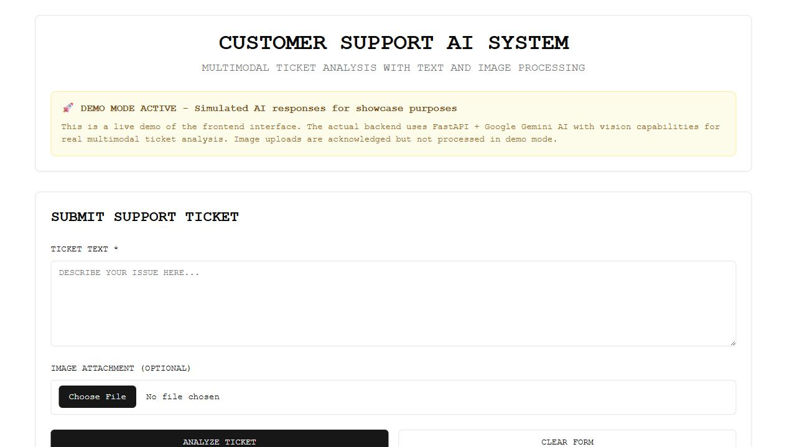

# Customer Support AI System

Customer-support portfolio application that turns ticket text and optional image attachments into structured triage signals: category, sentiment, priority, and a draft response.

Frontend demo: https://praciller.github.io/customer-support-on-twitter

> Public boundary: the GitHub Pages site and backend use deterministic local triage. Image attachments are acknowledged as context, but image pixels are not interpreted by the current public implementation.

## Preview



## What this demonstrates

- Support-ticket classification for common operational categories.
- Sentiment and priority estimation using deterministic rules.
- Bilingual Thai/English demo behavior.
- Draft-response generation with an explicit human-review boundary.
- React frontend, FastAPI backend, API integration, and GitHub Pages deployment.
- Frontend and backend testing setup.

## Architecture

```text
Ticket text + optional image
  -> React support UI
  -> FastAPI /analyze-ticket endpoint
  -> deterministic local triage
  -> structured category/sentiment/priority/draft
  -> UI result cards
```

The local processor does not require an external account, model endpoint, or API key.

## Tech stack

| Layer | Tools |
| --- | --- |
| Frontend | React 18, Tailwind CSS, shadcn/ui-style components, Axios |
| Backend | Python, FastAPI |
| Analysis | Deterministic bilingual ticket-triage rules |
| Deployment | GitHub Pages, GitHub Actions |
| Testing | Jest, React Testing Library, Playwright, pytest |

## Local setup

Frontend:

```bash
git clone https://github.com/Praciller/customer-support-on-twitter.git
cd customer-support-on-twitter/frontend
npm install
npm start
```

Backend:

```bash
cd backend
pip install -r requirements.txt
python main.py
```

Local URLs:

- Frontend: `http://localhost:3000`
- Backend: `http://localhost:8000`

## API

### POST `/analyze-ticket`

Input:

- `text`: ticket text
- `image`: optional image attachment; presence is recorded as context only

Output includes:

- `summary`
- `category`
- `sentiment`
- `priority`
- `draft_reply`
- `analysis_mode`
- `image_interpretation`

### GET `/health`

Returns backend readiness information.

## Evaluation cases

| Case | Expected behavior |
| --- | --- |
| Technical issue | Technical category and elevated priority |
| Billing complaint | Billing category with review-oriented response |
| Feature request | Feature category and lower urgency |
| Account/login issue | Account category and elevated priority |
| Image attached | Attachment is acknowledged without claiming pixel interpretation |
| Thai ticket | Thai labels and response draft |

Run frontend tests:

```bash
cd frontend
npm test
```

Run backend tests:

```bash
cd backend
pytest tests/ -v
```

## Limitations

- The current public processor is deterministic and rule-based; it does not infer image contents.
- Classification is intentionally bounded to a small set of demo categories and keywords.
- Draft replies require human verification before use with real customers.
- No production accuracy, compliance, or response-time guarantee is claimed.

## License

MIT
